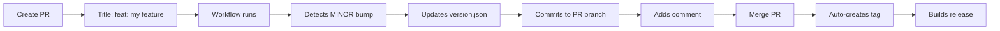

# Automated Versioning Guide

## Overview

McpManager uses a fully automated versioning system based on [Semantic Versioning](https://semver.org/) and [Conventional Commits](https://www.conventionalcommits.org/). The system requires **zero manual intervention** for version management.

## For Contributors

### TL;DR

1. Title your PR with conventional commit format (e.g., `feat: add feature`)
2. The workflow auto-updates `version.json` in your PR
3. Merge → automatic tag → automatic release

**You never touch `version.json` manually!**

### How It Works



### PR Title Format

Your PR title determines the version bump:

```
<type>[optional scope][!]: <description>
```

### Version Bump Rules

| Pattern | Bump Type | Example | Result |
|---------|-----------|---------|--------|
| `feat!:` or `BREAKING CHANGE` | **MAJOR** | `feat!: redesign API` | 0.1.0 → **1.0.0** |
| `feat:` | **MINOR** | `feat: add discovery` | 0.1.0 → **0.2.0** |
| `fix:`, `chore:`, `docs:`, etc. | **PATCH** | `fix: routing bug` | 0.1.0 → **0.1.1** |

### Conventional Commit Types

- **feat**: New feature → MINOR bump
- **fix**: Bug fix → PATCH bump
- **docs**: Documentation → PATCH bump
- **style**: Code style → PATCH bump
- **refactor**: Code refactoring → PATCH bump
- **perf**: Performance → PATCH bump
- **test**: Tests → PATCH bump
- **chore**: Maintenance → PATCH bump
- **ci**: CI/CD → PATCH bump

Add `!` after type for breaking changes: `feat!:` or `fix!:` → MAJOR bump

### Examples

#### Feature (Minor Bump)
```
PR Title: feat: add automatic server discovery
```
- Main: `0.1.0`
- PR: Auto-updated to `0.2.0`
- Merge → Tag `v0.2.0` created

#### Bug Fix (Patch Bump)
```
PR Title: fix: resolve desktop routing issue
```
- Main: `0.2.0`
- PR: Auto-updated to `0.2.1`
- Merge → Tag `v0.2.1` created

#### Breaking Change (Major Bump)
```
PR Title: feat!: redesign configuration API
```
- Main: `0.2.1`
- PR: Auto-updated to `1.0.0`
- Merge → Tag `v1.0.0` created

### Using Labels (Alternative)

If you don't use conventional commits, add labels:

- `breaking` → MAJOR
- `feature` or `enhancement` → MINOR
- `bug` or `fix` → PATCH

### What Gets Automated

✅ **Version Detection**: Parses PR title/labels  
✅ **Version Calculation**: Determines correct new version  
✅ **File Update**: Modifies `version.json` in your PR  
✅ **Commit**: Commits version change to your branch  
✅ **Validation**: Ensures version > main  
✅ **PR Comment**: Explains the version bump  
✅ **Tag Creation**: Creates git tag on merge  
✅ **Release Build**: Triggers release workflow  

### What You Don't Do

❌ Edit `version.json`  
❌ Create git tags  
❌ Calculate version numbers  
❌ Worry about version conflicts  
❌ Manually trigger releases  

### Workflow Details

#### On PR Open/Update (version-check.yml)

1. Checks out your PR branch
2. Gets current version from main
3. Parses PR title for commit type
4. Calculates new version
5. Updates `version.json` if needed
6. Commits and pushes to PR
7. Adds informative comment
8. Validates version is ahead of main

#### On Merge to Main (auto-tag.yml)

1. Reads version from `version.json`
2. Checks if tag exists
3. Creates `vX.Y.Z` tag
4. Pushes tag
5. Triggers release workflow

#### On Tag Push (release.yml)

1. Builds all platform artifacts
2. Creates Docker images
3. Creates GitHub release
4. Uploads artifacts

### FAQ

**Q: What if I forget conventional commit format?**  
A: Defaults to PATCH bump, workflow adds a reminder comment.

**Q: Can I override the automatic version?**  
A: Update your PR title or add/remove labels. Don't edit `version.json` directly.

**Q: What if version.json is already updated?**  
A: Workflow validates it's correct and skips update if so.

**Q: What if two PRs are open?**  
A: Each calculates from current main. First to merge wins. Second may need rebase.

**Q: Can I test this locally?**  
A: Yes! Install `nbgv`: `dotnet tool install -g nbgv`, then run `nbgv get-version`

**Q: What about pre-release versions?**  
A: PRs to non-main branches get pre-release versions automatically (e.g., `0.2.0-alpha.1`).

## For Maintainers

### Setup Requirements

1. **Branch Protection** (recommended):
   - Require PR reviews
   - Require status checks (CI)
   - No direct pushes to main

2. **Workflow Permissions**:
   - `contents: write` (auto-tag workflow)
   - `pull-requests: write` (version-check comments)

3. **Initial Version**:
   - Set in `version.json`: `"version": "0.1"`
   - First PR will bump to `0.1.1` or `0.2.0`

### Configuration

Edit `version.json`:

```json
{
  "version": "0.1",
  "versionHeightOffset": -1,
  "release": {
    "versionIncrement": "minor",
    "firstUnstableTag": "alpha"
  }
}
```

### Monitoring

- Check workflow runs in Actions tab
- Review version-check comments on PRs
- Monitor tags in Releases section

### Manual Override (Emergency Only)

If absolutely necessary:

```bash
# Update version.json manually
jq '.version = "1.0.0"' version.json > version.json.tmp
mv version.json.tmp version.json

# Commit and push
git add version.json
git commit -m "chore: emergency version bump to 1.0.0"
git push

# Create tag manually
git tag v1.0.0
git push origin v1.0.0
```

## Technical Details

### Workflow Files

- `.github/workflows/version-check.yml`: PR version automation
- `.github/workflows/auto-tag.yml`: Tag creation on main
- `.github/workflows/release.yml`: Release artifact builds
- `.github/workflows/ci.yml`: Build and test validation

### Version Detection Logic

```bash
# Breaking change detection
if [[ $PR_TITLE =~ ^.*!: ]] || [[ $PR_TITLE =~ BREAKING ]]; then
    BUMP=major
# Feature detection
elif [[ $PR_TITLE =~ ^feat ]]; then
    BUMP=minor
# Fix detection
elif [[ $PR_TITLE =~ ^fix ]]; then
    BUMP=patch
# Default
else
    BUMP=patch
fi
```

### Tools Used

- [Nerdbank.GitVersioning](https://github.com/dotnet/Nerdbank.GitVersioning): .NET version tool
- GitHub Actions: Workflow automation
- jq: JSON manipulation
- Semantic Versioning: Version format

## Benefits

✅ **Zero overhead**: No manual version management  
✅ **Consistent**: Every PR correctly versioned  
✅ **Traceable**: Clear version history  
✅ **Automated releases**: Merge → Release  
✅ **Developer friendly**: Just write good PR titles  
✅ **Enforced standards**: Conventional commits encouraged  
✅ **No conflicts**: Automatic version calculation  
✅ **Clear communication**: Automated PR comments  

## Migration from Manual Versioning

If migrating from manual versioning:

1. Determine current version (e.g., `1.2.3`)
2. Update `version.json`: `"version": "1.2"`
3. Enable workflows
4. Next PR will bump to `1.2.4`, `1.3.0`, or `2.0.0` based on type

---

**Questions?** See [CONTRIBUTING.md](../CONTRIBUTING.md) or open a discussion!
